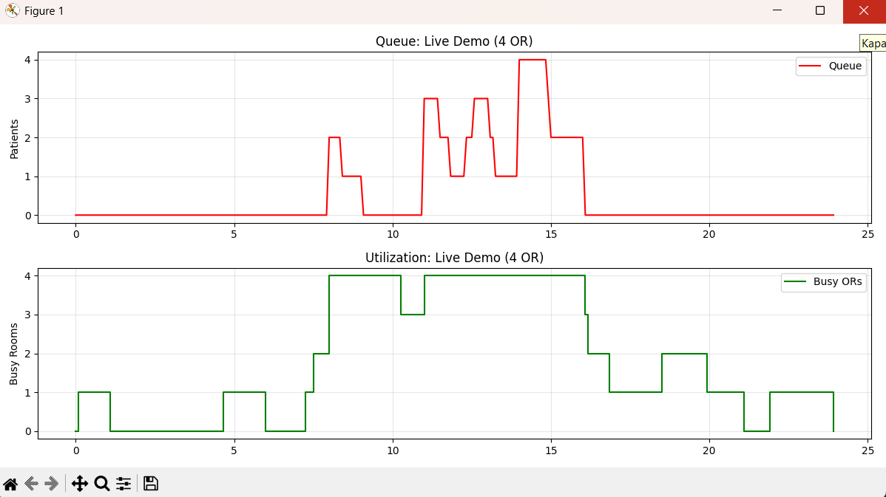
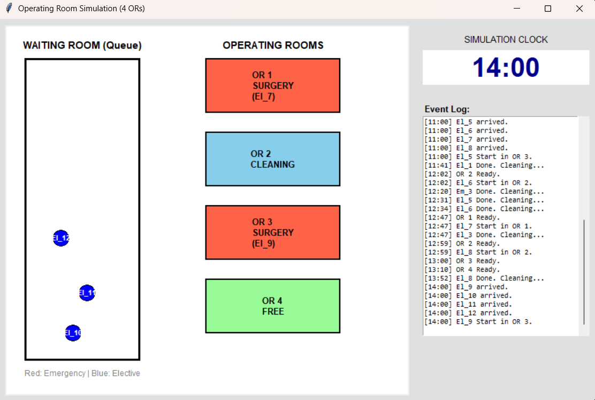
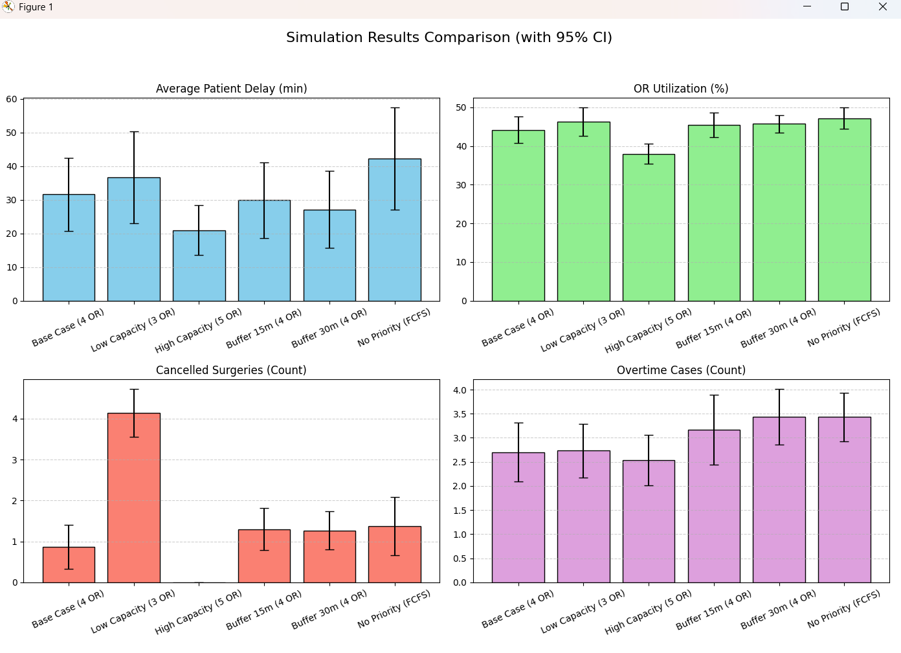
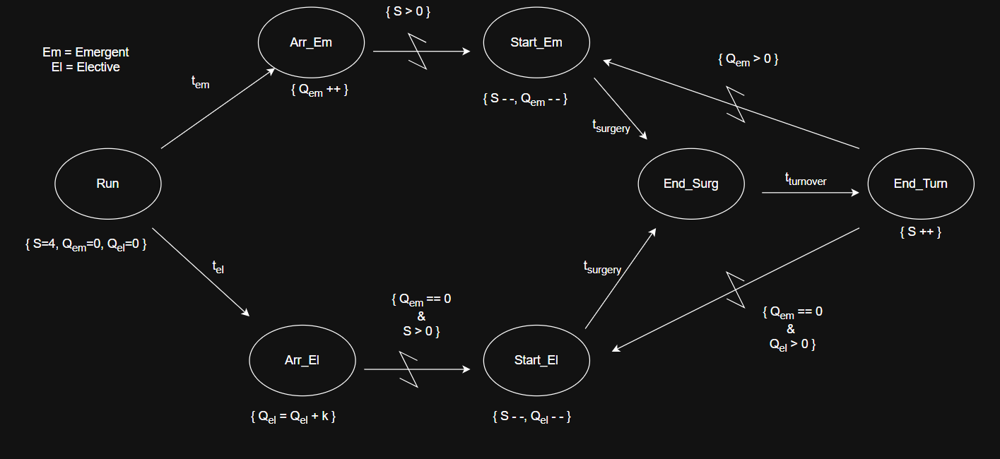

# Modelling and Simulation Course Project

## Project Overview
This project was developed as part of the Modelling and Simulation course. The primary objective is to simulate and analyze a discrete-event system to understand its behavior under various constraints. The project involves modeling the system's dynamics, implementing a visual simulation to observe the process flow in real-time, and conducting statistical analysis based on queue lengths and server utilization. Through this simulation, we aim to identify bottlenecks and optimize system performance.

## Simulation Details & Visuals

### 1. Statistical Analysis: Queue and Busy Tables

*This image displays the statistical output of the simulation. It includes detailed tables showing the "Queue" status (e.g., average waiting times, maximum queue length) and "Busy" status (server utilization rates) generated during the simulation run. These metrics are crucial for evaluating the efficiency of the modeled system.*

### 2. Visual Simulation Environment

*This screenshot captures the visual simulation interface. It illustrates the real-time movement of entities through the system, showing the interaction between service points and the queue. The visual representation helps in validating the model's logic and observing the system's dynamic behavior.*

### 3. Scenario Analysis

*This image presents a comparative analysis of different simulation scenarios. It highlights how changes in input parameters (such as arrival rates or service times) affect the overall system performance, allowing us to determine the most optimal configuration for the project.*

### 4. Event Graph

*This diagram represents the Event Graph of the system, illustrating the logical flow and relationships between discrete events. It defines the state transitions and scheduling logic that govern the underlying simulation model.*
---
*Developed for the Modelling and Simulation Course.*
